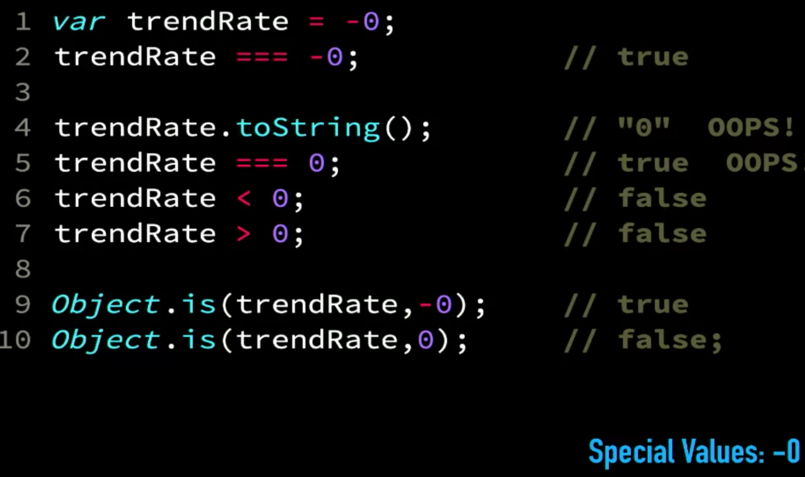
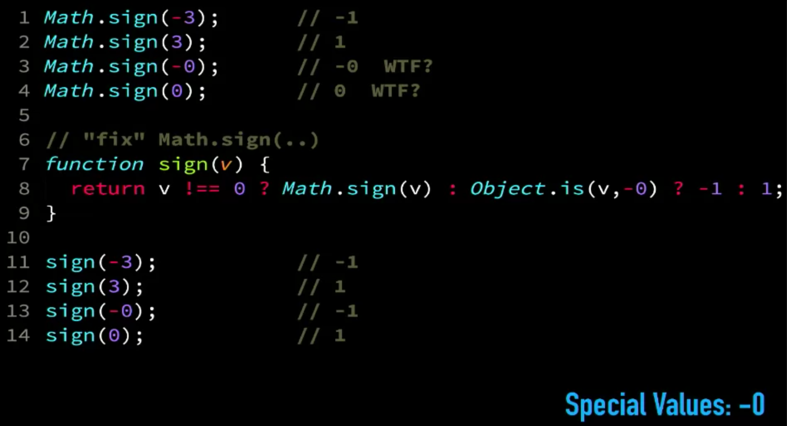
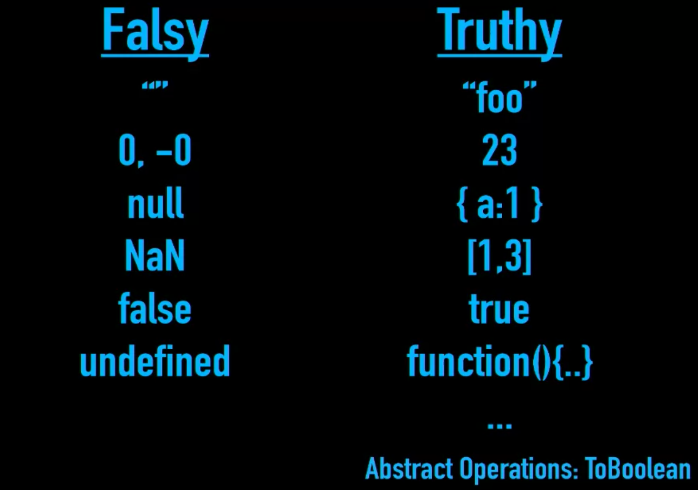

#Deep JavaScript Foundations
#0.Course intro

-   Use the JS spec

##Three pillars of the JavaScript language

-   Types
    _-_ Primitive Types
    _-_ Abstract operations
    _-_ Coercion
    _-_ Equality
    _-_ TypeScript, Flow, etc.

-   Scope
    _-_ Nested Scope
    _-_ Hoisting
    _-_ Closure
    _-_ Modules

-   Objects (Oriented)
    _-_ this
    _-_ class {}
    _-_ Prototype
    _-_ 00 vs 0L00

#1. Types

-   "In JavaScrip everything is an object" -> false

    

-   Primitive Types
    _-_ undefined
    _-_ string
    _-_ number
    _-_ boolean
    _-_ object
    _-_ null
    _-_ symbol
    _-_ bigint - Large integer support

    _-_ undeclared?
    _-_ function? Subtype of object, callable object
    _-_ array? Subtype of object

*   In JavaScript variables don't have types, values do.
*   typeof always returns a string

#2. Special Values
_-_ **NaN** -> Invalid number
_-_ **NaN is the only value that is not equal to itself**
_-_ Negative Zero

#3. Truthy and falsy values

